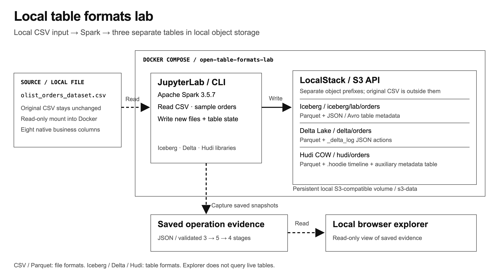

# Open table formats lab

Inspect how Apache Iceberg, Delta Lake and Apache Hudi record changes to the same Olist orders. This local Docker lab writes three independent tables, checks every business value after each operation, and exposes their metadata and physical file changes.

Use it to understand the difference between business rows, committed table state and an object-storage listing.

## Requirements

- Docker Engine or Docker Desktop with Compose v2.
- Python 3.9+ on the host for the explorer and test suite.
- Several GB of disk space for images and enough Docker memory for a 2 GB Spark driver.
- `olist_orders_dataset.csv` from the [Brazilian E-Commerce Public Dataset by Olist](https://www.kaggle.com/datasets/olistbr/brazilian-ecommerce). Download it separately and keep it outside the repository. See [data acquisition and license](DATA_LICENSE.md).

## Quick start

```sh
git clone https://github.com/bolablg/open-table-formats.git
cd open-table-formats/local-lab
export OLIST_SOURCE_CSV='/absolute/path/to/olist_orders_dataset.csv'
make -f Makefile.olist build
make -f Makefile.olist notebook
```

Open the token-bearing Jupyter URL printed in the logs at `http://127.0.0.1:8888`. Choose a notebook below, edit its `CONFIG` cell, and run cells in order. The source CSV is mounted read-only; each run uses separate table prefixes.

## Choose a notebook

| Notebook | What to explore | Default row counts |
| --- | --- | --- |
| [Manual walkthrough](local-lab/notebooks/Olist_Table_Formats_Manual.ipynb) | Read the SQL and DataFrame writes directly in cells, then inspect metadata after create, insert, update and delete. | 3 → 5 → 5 → 4 |
| [Automated walkthrough](local-lab/notebooks/Olist_Table_Formats.ipynb) | Run create, insert and delete through the shared runner, with saved snapshots for the explorer. | 3 → 5 → 4 |

Both preserve Olist's eight native fields and nullable lifecycle timestamps. Sampling counts and seed are configurable. The manual update adds one day to an estimated delivery date as a controlled example.

See the [manual guide](local-lab/docs/manual-walkthrough.md) or [automated guide](local-lab/docs/olist-walkthrough.md) for headless execution, configuration, validation and reset instructions.

## Explore the results

In another terminal, from `local-lab/`:

```sh
make -f Makefile.olist explorer
```

Open [the local explorer](http://127.0.0.1:8765). After an automated operation, select **Refresh evidence** to compare rows, row changes, schemas, metadata and file changes. The explorer reads saved automated snapshots. Manual notebook outputs are inspected in the notebook.

## Architecture



[Editable SVG](local-lab/docs/assets/local-architecture.svg) · [Local lab guide](local-lab/README.md)

The stack pins Spark 3.5.7, Iceberg 1.11.0, Delta Lake 3.3.2 and Hudi 1.2.0. Iceberg uses format v2 with copy-on-write row changes; Hudi uses Copy-on-Write. LocalStack provides the local S3-compatible API.

## Scope

This is a sequential correctness and metadata exercise on one Spark stack. It does not test production performance, concurrent writers, crash recovery, streaming ingestion or cross-engine interoperability. Physical object counts include retained data and metadata; they are not a performance ranking.

Keep source-derived outputs and credentials local. The dataset is not bundled, and its [CC BY-NC-SA 4.0 terms](https://creativecommons.org/licenses/by-nc-sa/4.0/) apply separately to Olist data and derived material.

Run the local tests from `local-lab/`:

```sh
make -f Makefile.olist test
```
